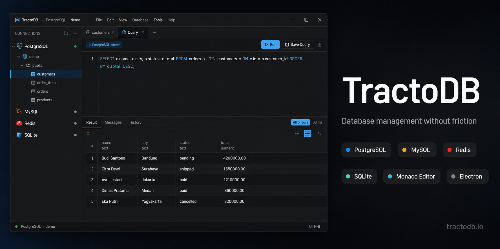
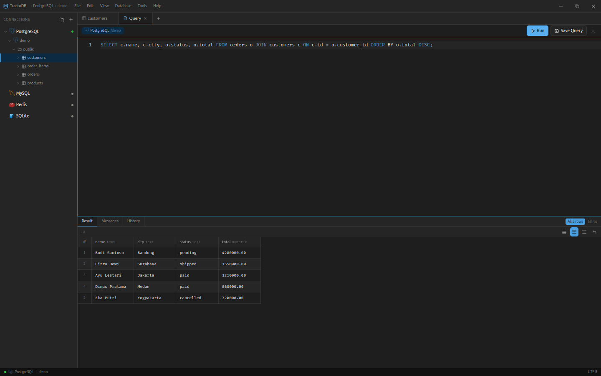
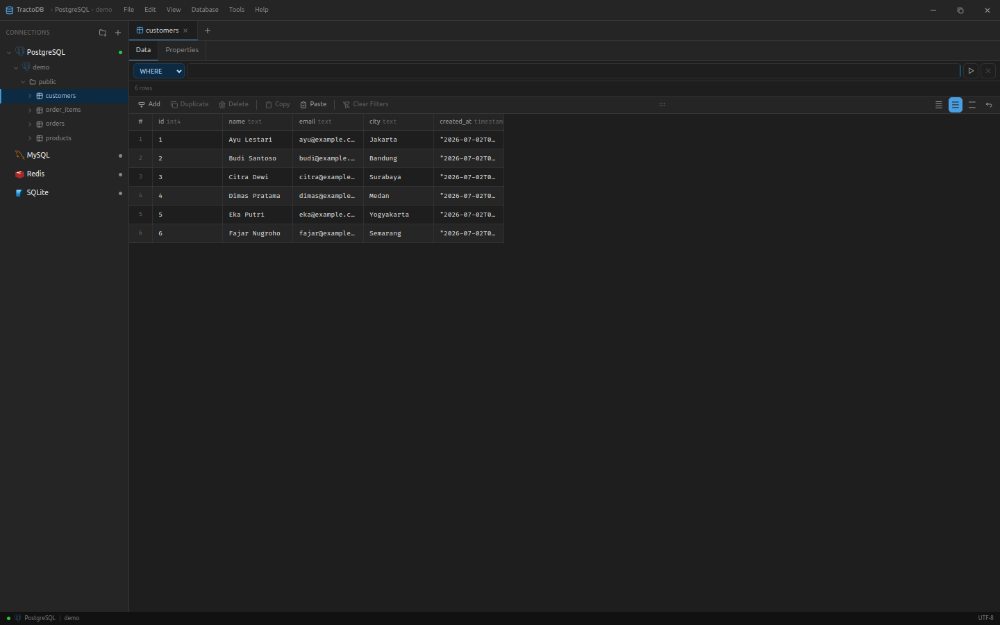
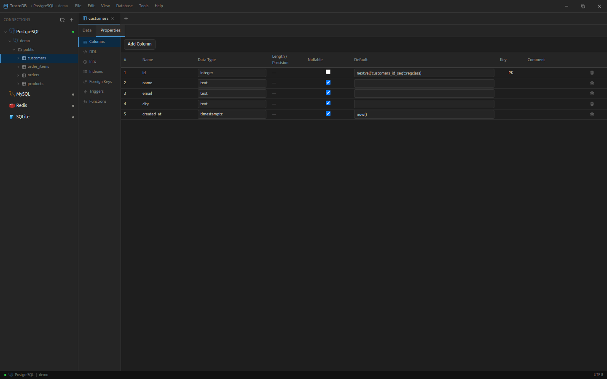
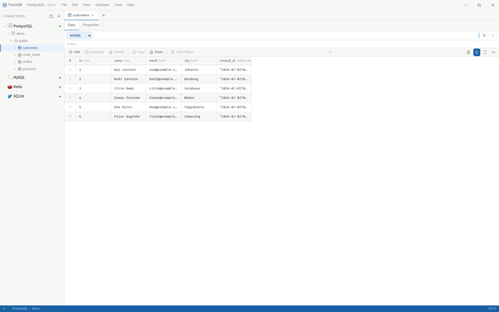

<div align="center">



<br />

<h1>TractoDB</h1>

<p><em>From Latin <strong>tracto</strong> — to handle, to manage.</em></p>

<p>
  A modern, minimalist desktop database manager.<br/>
  DBeaver's power. Linear's clarity. Zero friction.
</p>

<br/>

[](LICENSE)
[](#)
[](#)
[](#)
[](#)
[](#)

<br/>

[**Download**](#installation) · [**Screenshots**](#screenshots) · [**Development**](#development-setup) · [**Contributing**](#contributing-with-claude-code)

</div>

---

## What is TractoDB?

TractoDB is a **desktop database management tool** — not a database engine. Like DBeaver, it connects to databases you already have running (locally or on a remote VPS) and gives you a clean, fast interface to manage them.

> **"Tracto"** (Latin) — *to drag, to handle, to manage.* The name reflects the core purpose: handling databases without friction, pulling data into view without writing every query by hand.

---

## Screenshots

<table>
  <tr>
    <td align="center"><br/><sub>Query Editor with smart autocomplete</sub></td>
    <td align="center"><br/><sub>Data grid with inline editing</sub></td>
  </tr>
  <tr>
    <td align="center"><br/><sub>Table Properties panel</sub></td>
    <td align="center"><br/><sub>Light mode</sub></td>
  </tr>
</table>

---

## Features

### 🔌 Multi-database support
Connect to **PostgreSQL**, **MySQL**, **SQLite**, and **Redis** — locally or on any remote VPS via IP + Port. Manage multiple connections simultaneously, organized in folders with color labels.

### ✏️ Query Editor
Powered by **Monaco Editor** (the same engine behind VS Code):
- Syntax highlighting for SQL dialects
- Smart alias auto-generation (`model_has_roles` → `mhr`)
- Dot-notation column suggestions (`u.` → shows columns of the `users` table)
- Saved queries per database — accessible from the sidebar

### 📊 Data Grid
- **Inline editing** with staged changes — review SQL before saving
- **Multi-row selection** with Ctrl+click and Shift+click range
- **Add, duplicate, delete rows** with undo support
- **Copy as** TSV (Excel), JSON, SQL INSERT, or Markdown table
- **Paste from Excel** — fills columns automatically
- **Column filters** — type-aware: checkbox list, range, date picker, JSONB text search
- **Resizable and reorderable columns** — session-only, resets on tab close

### 🗄️ Table Properties
Full DBeaver-style Properties panel with:
- **Columns** — editable with type dropdown, length/precision fields
- **DDL** — complete runnable script (CREATE TABLE + indexes + constraints + triggers + functions)
- **Indexes, Foreign Keys, Triggers, Functions** — all in one place
- Clickable FK references → opens the referenced table instantly

### 💾 Backup & Restore
Native CLI approach (same as DBeaver):
- Uses `pg_dump` / `pg_restore` / `mysqldump` — auto-detected from PATH
- Format options: Plain, Custom, Tar, Directory (PostgreSQL)
- **Backup All Tables** in one click
- Streaming progress log with Copy Error button

### 🔒 Production Safety
Mark connections as **Production** or **Development**:
- Production connections shown in **red** throughout the UI
- All write operations blocked on production (INSERT, UPDATE, DELETE, DROP, ALTER)
- Table deletion blocked on production with a toast notification

### 🎨 Appearance
- **Frameless window** — VS Code-style custom title bar with inline menu bar
- **Light / Dark / System** theme — switch anytime with Ctrl+,
- **Preferences** — font family, font size, grid stripe color and intensity, density mode
- Passwords stored in OS Keychain (libsecret on Linux, Keychain on macOS)

---

## Supported Databases

| Database | Version | Connection | Backup/Restore |
|---|---|---|---|
| PostgreSQL | Any | TCP direct | ✅ pg_dump / pg_restore |
| MySQL / MariaDB | Any | TCP direct | ✅ mysqldump / mysql |
| SQLite | Any | File | ✅ File copy |
| Redis | Any | TCP direct | — |

> TractoDB is a **management client only** — it does not bundle or install any database engine. Your databases must be running separately.

---

## Installation

### Download

| Platform | Format | Link |
|---|---|---|
| Ubuntu / Debian | `.deb` | [Latest release →](https://github.com/yourname/tractodb/releases/latest) |
| Linux (any) | `.AppImage` | [Latest release →](https://github.com/yourname/tractodb/releases/latest) |
| macOS | `.dmg` | Coming soon |
| Windows | `.exe` | Coming soon |

### Ubuntu / Debian

```bash
# Download and install the .deb
sudo dpkg -i tractodb_*.deb

# Required system dependencies (one-time)
sudo apt install libsecret-1-0
```

### AppImage

```bash
# Make executable and run
chmod +x TractoDB-*.AppImage
./TractoDB-*.AppImage
```

---

## Development Setup

### Prerequisites

```bash
# Ubuntu / Linux
sudo apt install build-essential python3 libsecret-1-dev

# Install bun (package manager)
curl -fsSL https://bun.sh/install | bash

# macOS
xcode-select --install
```

### Run locally

```bash
# Clone the repo
git clone https://github.com/yourname/tractodb
cd tractodb

# Install dependencies
bun install

# Start with hot reload
bun start

# Type check
bun run typecheck

# Lint
bun run lint
```

### Build for production

```bash
# Linux (.deb + .AppImage)
bun run package:linux

# Output in ./release/
```

---

## Tech Stack

| Layer | Technology |
|---|---|
| Desktop shell | [Electron](https://electronjs.org) v33+ |
| Frontend | [React](https://react.dev) 18 + [TypeScript](https://typescriptlang.org) (strict) |
| Query editor | [Monaco Editor](https://microsoft.github.io/monaco-editor/) (VS Code engine) |
| Build tool | [Vite](https://vitejs.dev) |
| State | [Zustand](https://zustand-demo.pmnd.rs) |
| Styling | CSS Modules + CSS Variables (no framework) |
| Icons | [Flaticon UIcons](https://www.flaticon.com/uicons) |
| Package manager | [Bun](https://bun.sh) |
| DB drivers | pg · mysql2 · better-sqlite3 · ioredis |

---

## Project Philosophy

- **Management tool only** — TractoDB connects to your databases. It does not bundle or start any database engine (same approach as DBeaver).
- **No vendor lock-in** — standard SQL drivers, standard file formats, your data stays yours.
- **Native feel** — frameless window, OS keychain integration, system font, no web-app aesthetics.
- **Safe by default** — production connections are read-only. Destructive operations require explicit confirmation with typed input.

---

## License

MIT © TractoDB Contributors

---
