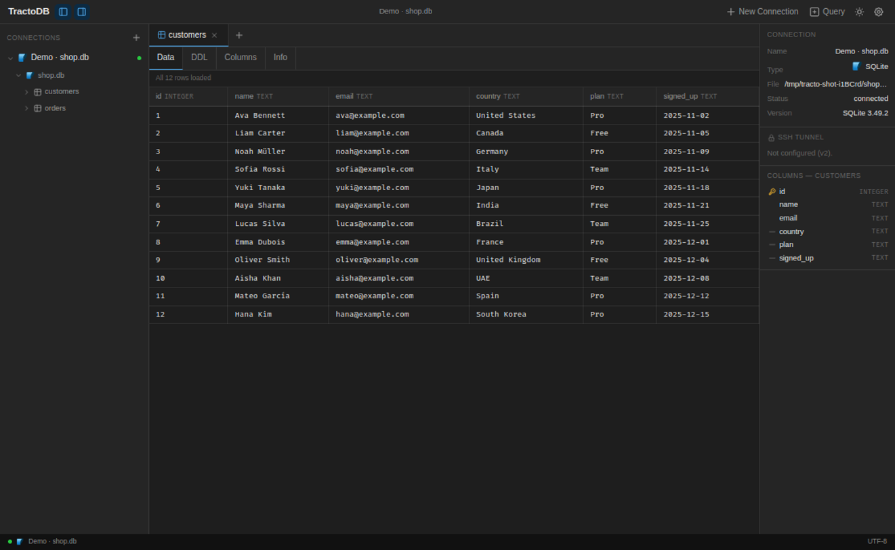

# TractoDB

TractoDB (from Latin 'tracto': to handle, to manage) is a modern minimalist desktop database manager for Ubuntu. Inspired by DBeaver's power, designed with Linear's clarity.



## Features (V1)

- **Multi-database support**: PostgreSQL, MySQL, SQLite, Redis
- **Remote connections**: Connect to any database via IP + Port
- **Query editor**: Monaco Editor (VS Code engine) with syntax highlighting and autocomplete
- **Schema browser**: Navigate databases, tables, views, and columns
- **Results grid**: Fast data grid with sorting and copy support
- **Tab management**: Work with multiple queries and tables simultaneously
- **Resizable panels**: Customize your workspace layout
- **Dark / Light mode**: Automatic system detection + manual toggle
- **Secure storage**: Passwords stored in OS Keychain (libsecret on Linux)

## Requirements

### Ubuntu / Linux

```bash
# Build tools for native modules
sudo apt install build-essential python3 python3-pip

# For keytar (OS Keychain)
sudo apt install libsecret-1-dev

# For AppImage
sudo apt install libfuse2
```

### macOS

```bash
xcode-select --install
```

## Development Setup

```bash
# Clone
git clone https://github.com/yourname/tractodb
cd tractodb

# Install dependencies (requires bun)
bun install

# Start development (hot reload)
bun start

# Type check
bun run typecheck

# Lint
bun run lint
```

## Build for Production

```bash
# Build .deb and .AppImage for Linux
bun run package:linux

# Output in ./release/
```

## Project Structure

See `CLAUDE.md` for the full project structure and architecture decisions.

## Contributing with Claude Code

This project is designed to be built with Claude Code. Key files:

| File | Purpose |
|---|---|
| `CLAUDE.md` | Architecture, conventions, commands |
| `AGENTS.md` | Agent workflow rules |
| `DESIGN.md` | Visual design system (colors, spacing, components) |
| `TASKS.md` | Implementation checklist |
| `CONTEXT.md` | Quick context for new sessions |
| `shared/ipc.ts` | IPC types and channel names |

### Starting a new Claude Code session

Paste this prompt:
```
Read CONTEXT.md, CLAUDE.md, AGENTS.md, and DESIGN.md first.
Then check TASKS.md and continue from the first uncompleted task.
```

## Tech Stack

- **Electron** — Desktop shell
- **React + TypeScript** — UI
- **Vite** — Build tool
- **Monaco Editor** — Query editor (VS Code engine)
- **Zustand** — State management
- **CSS Modules** — Styling (no CSS framework)
- **bun** — Package manager

## License

MIT
